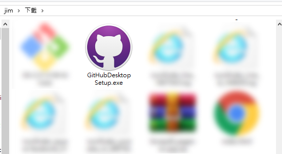
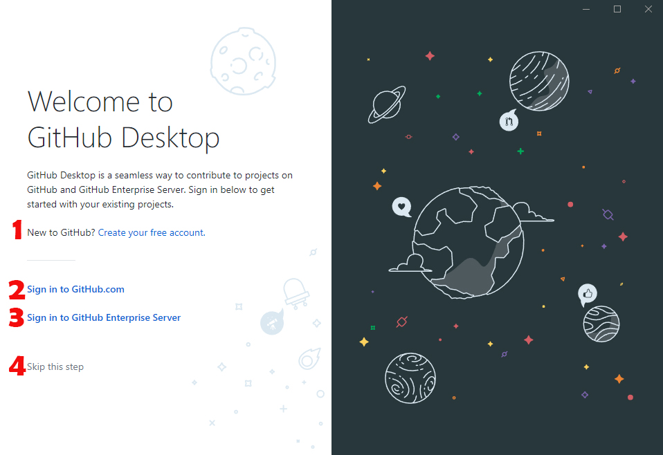
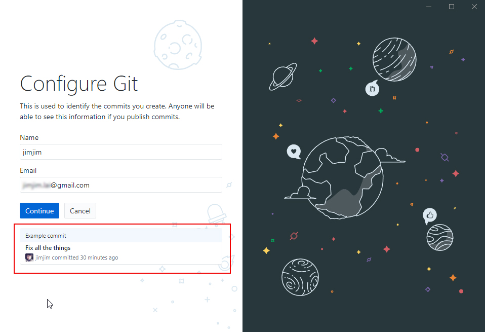

# GitHub Desktop 版本控制

## [GitHub Desktop](https://desktop.github.com/)

GitHub 常讓使用者頭痛語法的問題，但有視覺GUI介面的GitHub，可以降低語法錯誤造成的失誤，GitHub Desktop是為了設計人員開發的視覺化軟體，也比較容易操作簡單

* 開啟GitHub Desktop 網頁
* 點擊 Downloand for Windows 請注意GitHub 有For Windows 版和 For MAC版

### 安裝GitHub

點擊下載下來的軟體安裝

安裝完成後，接著出現歡迎畫面，裡面有幾個登入的選項

1. Create your free account ，如果你沒有GitHub帳戶那就點這個，建立Github免費帳戶
2. Sign into Github.com ，已經有GitHub帳號的，請直接登入Github.com
3. Sign into Github Enterprise，登入Github企業帳戶
4. Skip this step ，跳過這個步驟，不登入

### 登入

選擇使用已經有的帳號登入GitHub

帳號密碼如果輸入正確，就會跳出你自己的github帳號，那接著就點擊 Continue 

這是一個GITHUB 收集數據的訊息提醒，你願樣讓他們蒐集使用的數據就打勾，不願意就不要打勾，最後按 Finish

### 正式進入GitHub Desktop使用畫面

右邊是你原本在GitHub就有的 Repositories\(儲存庫 \)

左邊則是選擇你想使用Repositories的方式

1. Create a tutorial repository ，如果你不知道如何創建新的儲存庫，那這就是教學
2. Clone a repository from the Internet，從你的Github網頁上，Clone一個儲存庫
3. Create a New repository on your hard drive，創建一個新儲存庫在你的硬碟上
4. Add an Existing Repository from your hard drive，從硬碟中添加現有儲存庫

那我們就選擇創建一個新的儲存庫Repository

Name，就是你 Repository儲存庫的名稱，Description 描述你的資料

Local path你本機電腦網頁放的位置，其他就不用管它了，點擊 **Create repository，**就創建了一個 Repository儲存庫

