# SourceTree 操作

我們要使用SourceTree將網頁檔案Push推上GitHub

請先登入GitHub網頁，並建立一個新的專案


github.io網址前面的使用者名稱，就只能是github的註冊名稱，一個人就是只能有一個網址而已


專案請記得名稱後面直接加上github.io，然後其他都不需要動，直接Creat repository產生儲存庫

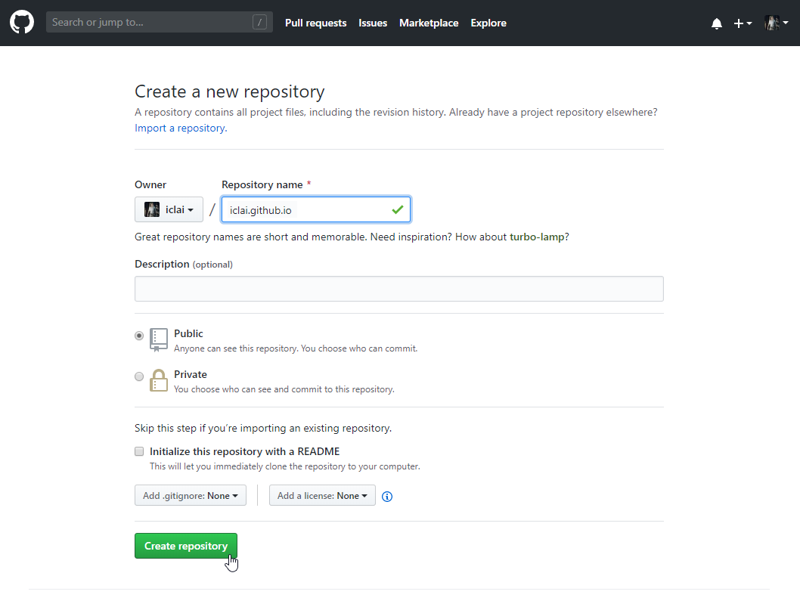

專案的github 網址產生，但這只是可以連結到儲存庫的網址，並不是網頁的網址喔！

我們需要用以下的儲存庫網址來讓SourceTree使用，才能Push上去GitHub，所以請將你們自己的gitHUB

網址複製起來，也就是紅框圈起的位置。

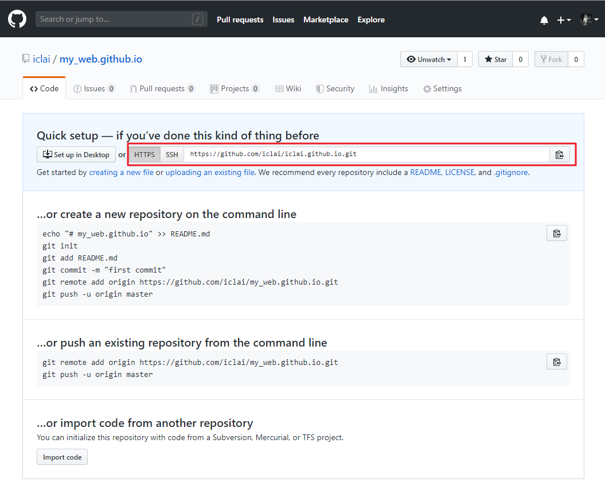

點擊SourceTree的　Create＋　按鈕，點Browse選擇你網頁的資料夾位置，Name輸入自訂專案名稱，再點擊Create按鈕

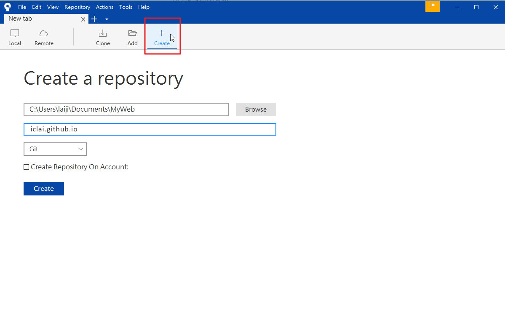

我們做好的網頁檔案就會出現在SoucreTree

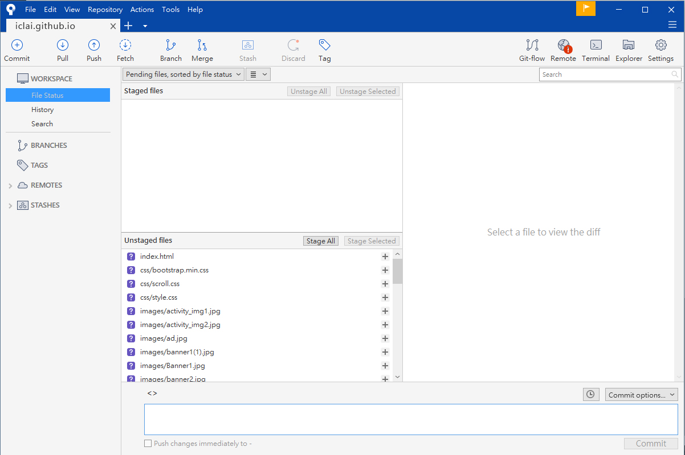

我們也可以開啟我們的網頁資料夾，檢查看看是不是有多一個.git的資料夾，如果有，就表示成功將目錄初始化

接著設定remote repository的位址，接著點選上面的Remote

因為我們剛剛安裝時我們選擇後面才設定，所以會跳出這個視窗訊息，那我們按Settings

點選　Add來新增一個remote repository

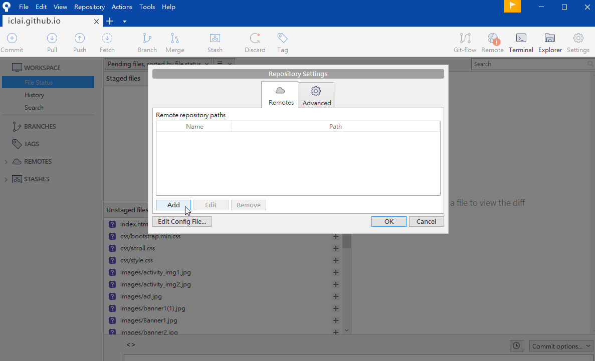

貼上我們的GitHub網址並將Default remote打勾勾，Host Type並選擇GitHub

填寫你要提交出去的作者名稱，後點OK

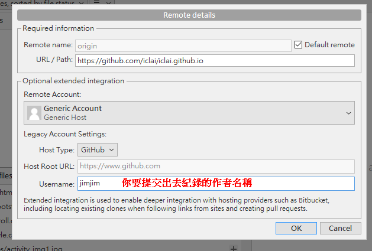

就會看到剛剛我們新增的儲存庫網址，然後點OK

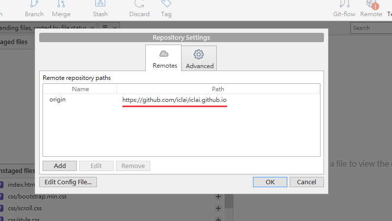

SourceTree的Unstaged　files區域，就是我們還沒Push上去的檔案，因為還沒有commit。

那我們就選擇Stage All，一次全部改變他的狀態。

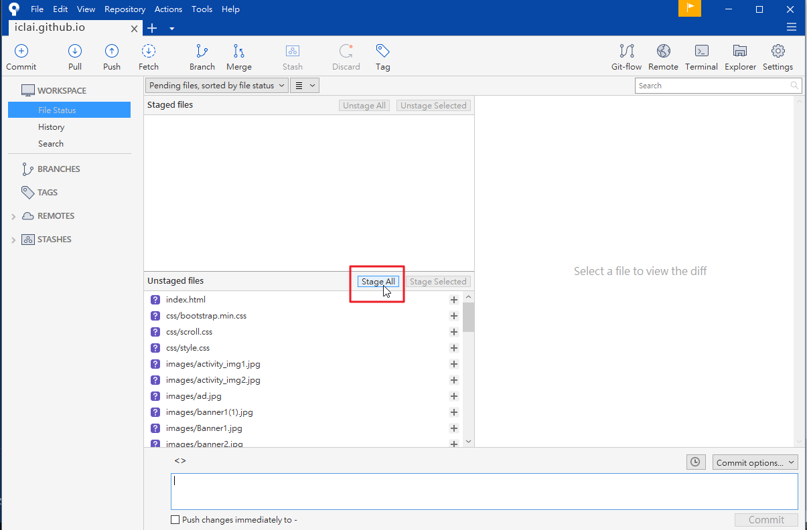

完成就會變成跑到上面的Staged Files區域了，你也可以在右邊的視窗看見自己的網頁原始碼

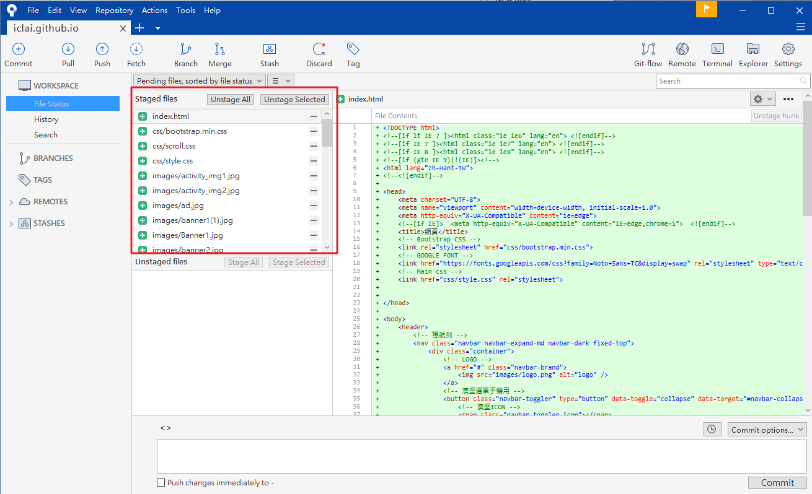

在訊息欄位輸入你自己和別人看得懂紀錄文字，可以輸入中文，接著點選Commit 按鈕

### 出現錯誤訊息

如果你有跳出這種視窗，是因為你的emil或是使用者名稱沒有符合規定寫法，也許有空格你沒注意到，那就要修正才能Commit。  
如果你們有出現這視窗就跳過這個步驟

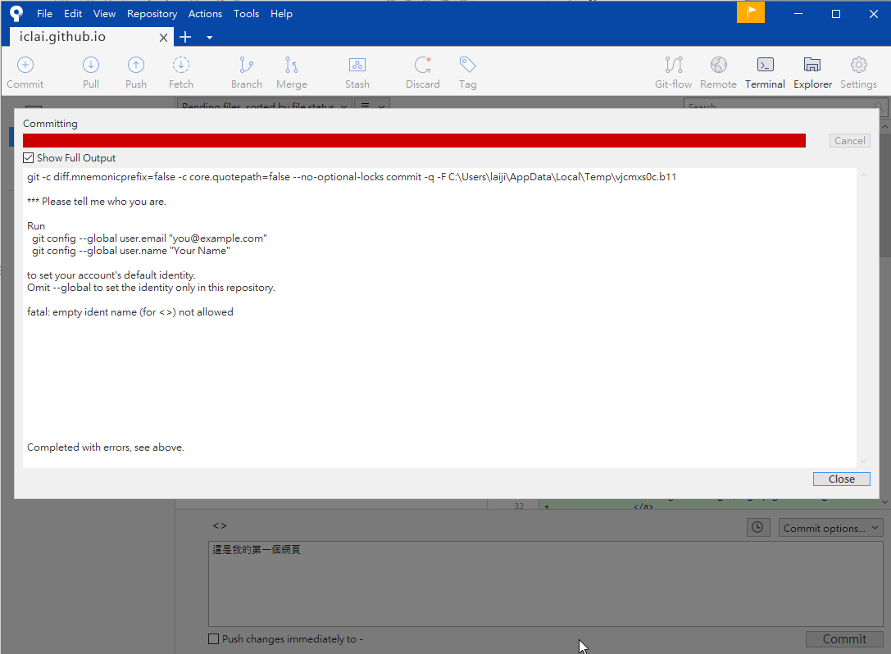

修正錯誤到Tool 底下的Options，發現我的名稱多了空格，取消空格後按OK，就可以Commit了

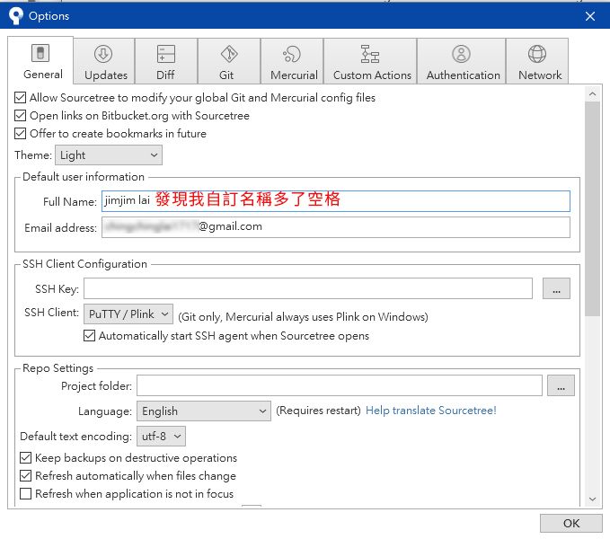

### Commit完成

commit完成，你會發現在Branch底下的提交紀錄有一master主支，裡面有我們的紀錄

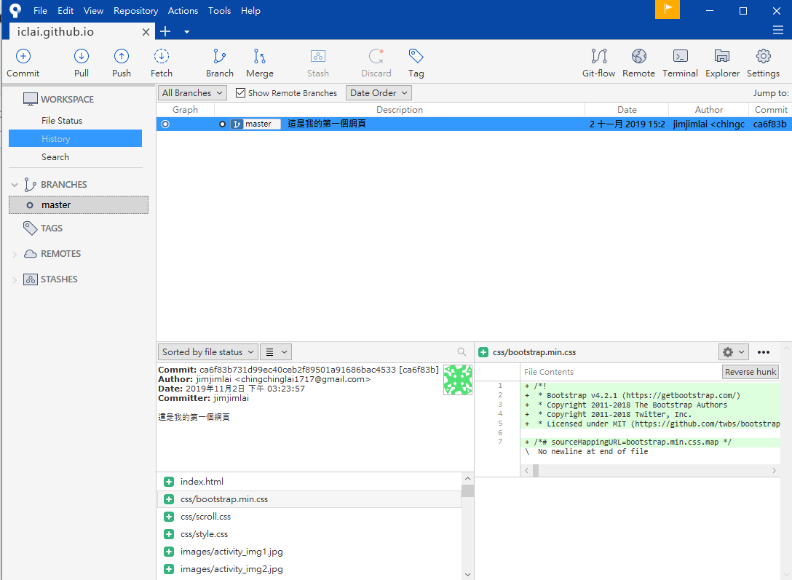

接著點選Push，把檔案推上GitHub

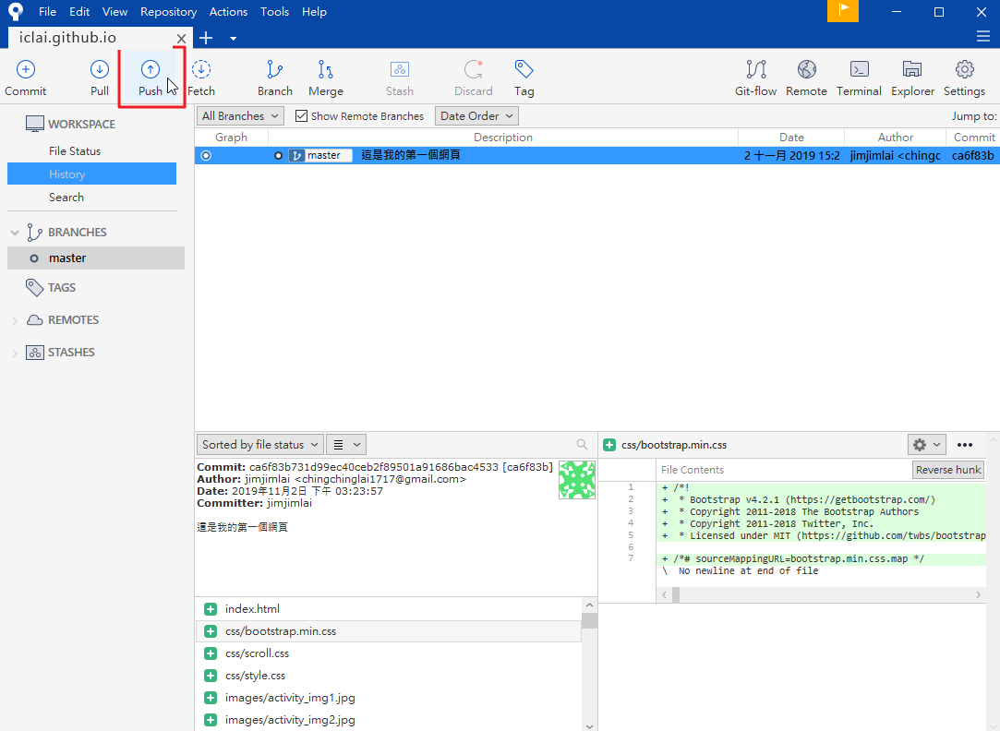

將repository中唯一的主支master勾選起來，接著按Push

SourceTree要開始傳送，但因為我們沒有登入GitHub，他無法Push上去，所以我們要輸入帳號密碼登入GitHub

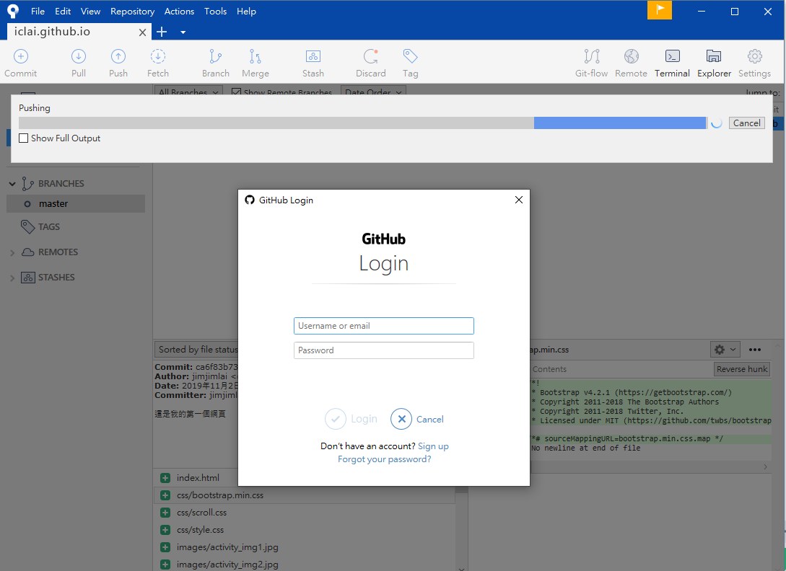

傳送完成他會出現遠端分支

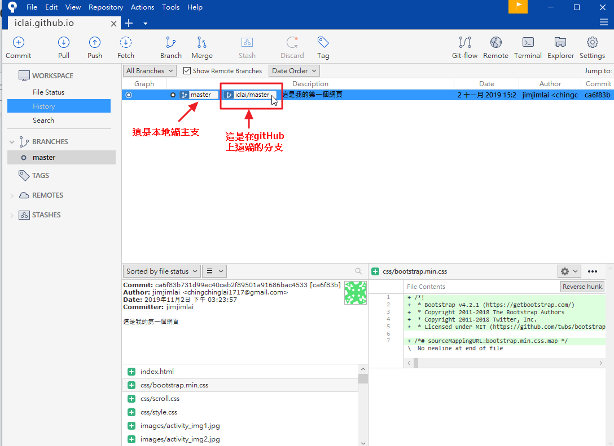

回到Github 網頁就會看到我們剛剛Push上去的網頁檔案了喔!!

一樣點擊setting 往下拉就會看見我們的網頁網址了

