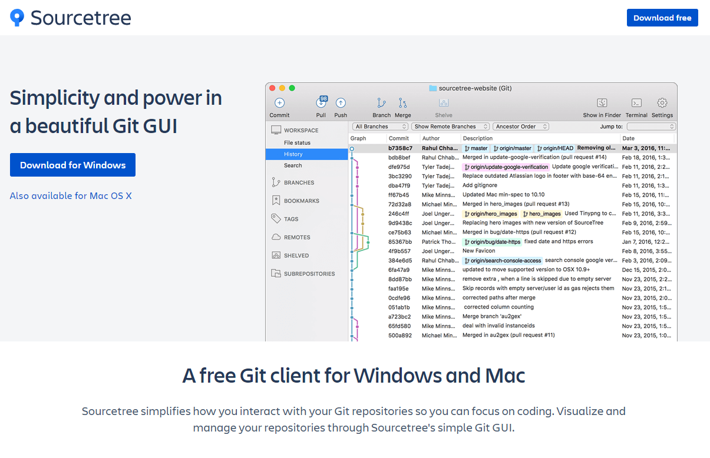
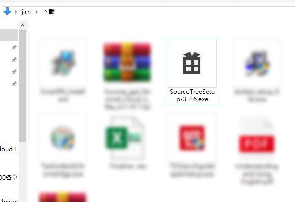
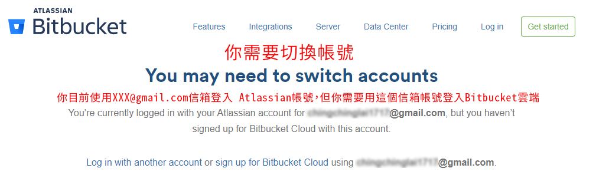
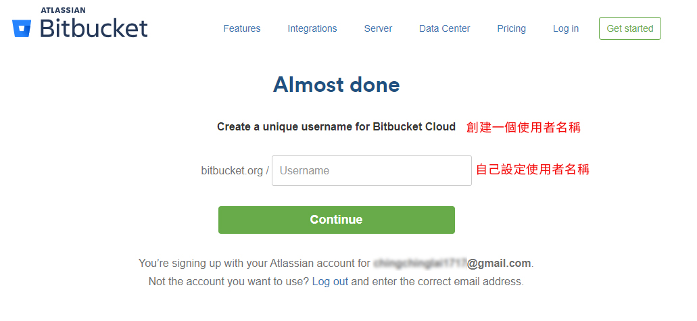
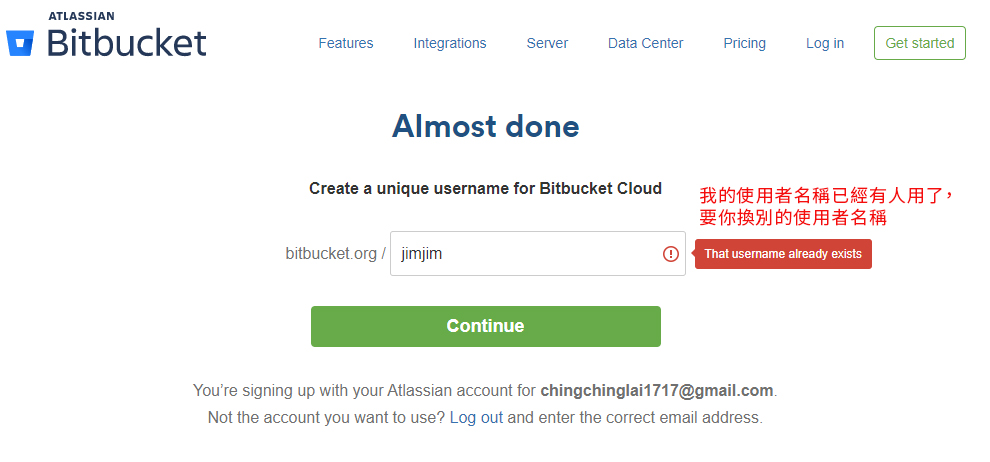
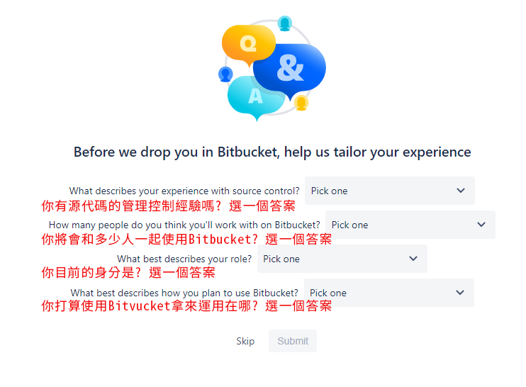
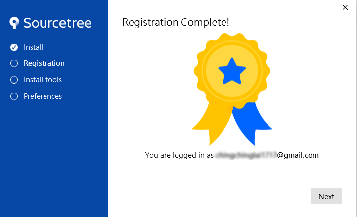
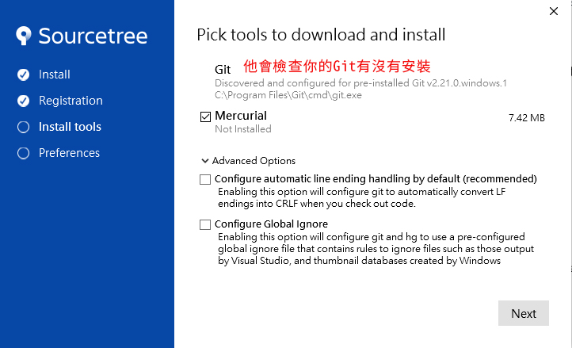
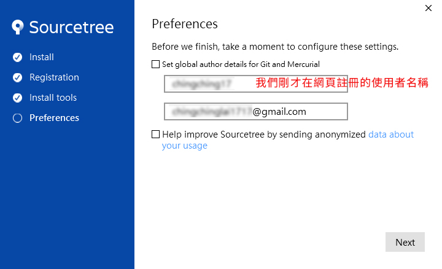
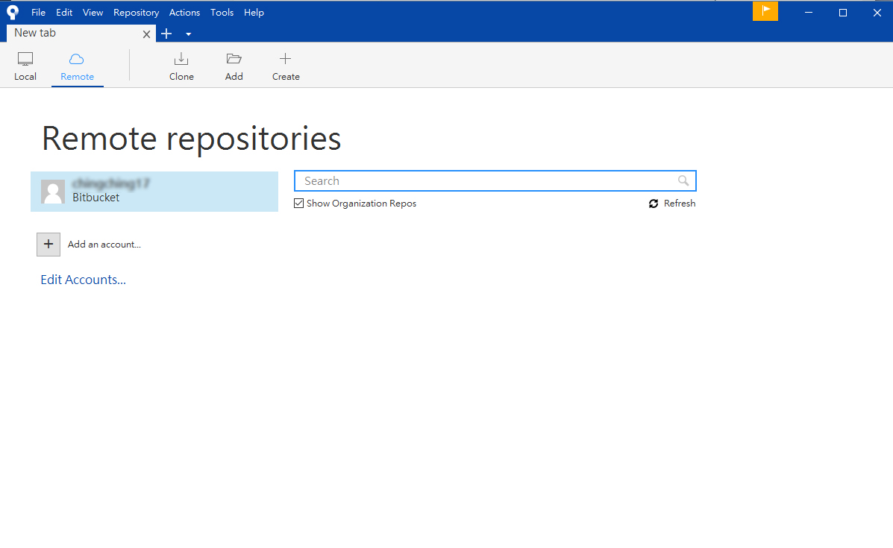

# SourceTree的版本控制安裝

### [SourecTree](https://www.sourcetreeapp.com/)

SourceTree也是可以操作Git版本控制的另一個GUI 的視覺介面，而且也是免費，但他**安裝較GitHub Desktop麻煩，請有心理準備**

進入官網選擇你要用Windows版本或是Mac版本的軟體下載，跳出視窗你需要勾選下方同意才能下載

下載完成安裝SourdeTree

### 安裝步驟

Registration 註冊

下方一長串英文是在告訴你，SourecTree 是免費的產品，但你需要先註冊Atassian Bitbucket 帳號，或著你也可以使用綁定Google、GitHub、Gitlab、等你已經有的現有帳號，來使用。

那我們就使用Google帳號來綁定

點擊 Bitbuket ，會開啟網頁，要你註冊Atassian Bitbucket 帳號頁面，可以直接選擇Google登入，登入後因為我們不曾在Atassian Bitbucket註冊過，他還是會要求你的Google帳號要登入它們的Bitbucket Cloud 雲端，做綁定的動作。

這個使用者名稱，未來也是你的雲端網址

如果使用者名稱通過了，就會轉換以下畫面，類似問卷調查，你可以選擇回答，或是Skip 略過不答，如果答好了就Submit 送出就可以了。

最後，就會出現Bitbuket的雲端網頁，他其實就是類似GitHub一樣的功能頁面，你也可以上傳你的網頁到這裡，你可以把他想成，他是GitHub的另一個品牌的樣子。

就像一樣是車子都有可以開的功能，但品牌種類就有很多，但你可以選擇你喜歡或是習慣使用的品牌。

接著就可以回到本機上面的SorceTree上，再點一次Bitbucket

SourceTree會等待你的帳號確認，所以你需要點擊跳出來的網頁上同意授權訪問的Grant access的按鈕

同意後之後，本機上的SourceTree才會顯示註冊完成，接著按下 Next就會開始安裝工具

### 安裝工具

1. 他會檢查你電腦有沒有安裝Git
2. Mercurial 與 git 一樣是分散式版本控制軟體，看你自己要步要安裝
3. 下面兩個就暫時先不用勾選
4. 按下一步

他會直接顯示我們剛才在網頁註冊的使用者名稱，就不需要我們再填入，接著按下一步

### 設置 SSH Key

你如果有SSH Key可以在這時候加上去，也可以等進入軟體之後再加，那我們點NO 等一會再加

### 完成安裝

終於正式進入到軟體介面了

